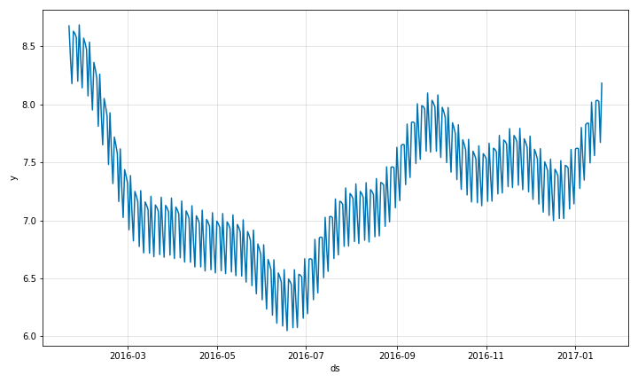
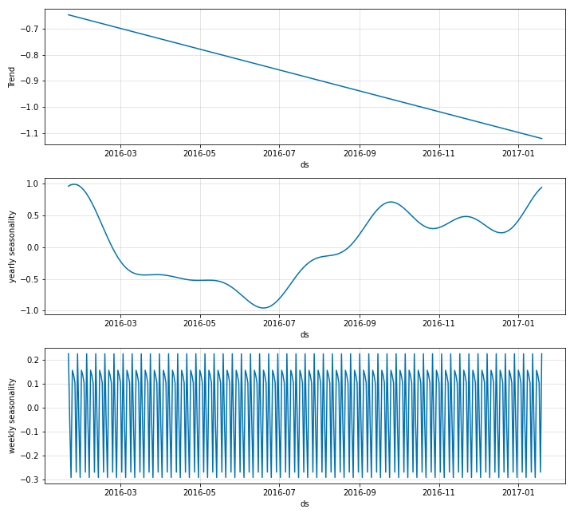
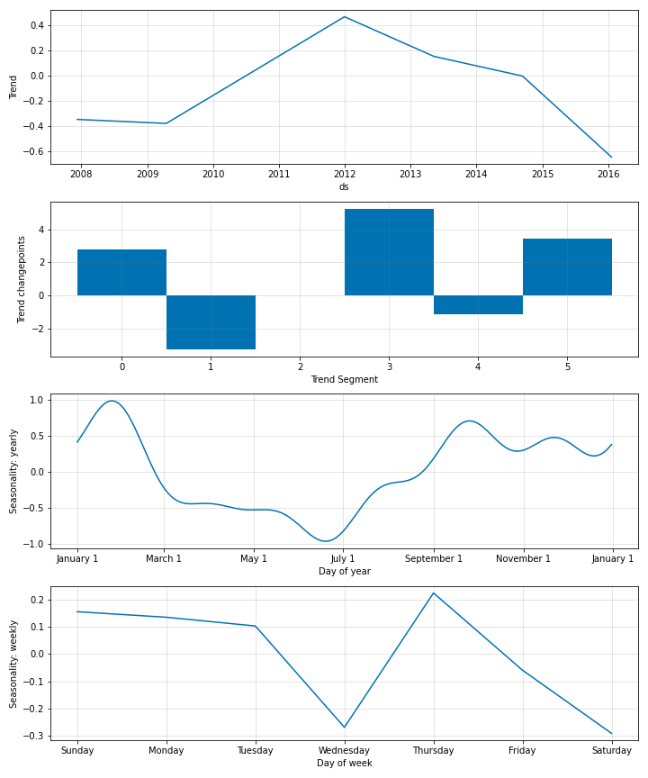

# Quick Start Guide
This page contains details of how you can build a simple model using NeuralProphet with 
minimal features.

## Install
After downloading the code repository (via `git clone`), change to the repository directory (`cd neural_prophet`) and install neuralprophet as python package with
`pip install .`

Note: If you plan to use the package in a Jupyter notebook, it is recommended to install the 'live' package version with `pip install .[live]`.
This will allow you to enable `plot_live_loss` in the `train` function to get a live plot of train (and validation) loss.

### Import
Now you can use NeuralProphet in your code:
```python
from neuralprophet import NeuralProphet
```

 
## Input Data

The input data format expected by the `neural_prophet` package is the same as in original 
`prophet`. It should have two columns, `ds` which has the timestamps and `y` column which
contains the observed values of the time series. Throughout this documentation, we 
will be using the time series data of the log daily page views for the [Peyton Manning](https://en.wikipedia.org/wiki/Peyton_Manning)
Wikipedia page. The data can be imported as follows.

```python
import pandas as pd
df = pd.read_csv('../example_data/example_wp_log_peyton_manning.csv')
```

The format of the data looks like below.

ds | y | 
------------ | ------------- |
2007-12-10|9.59|
2007-12-11|8.52|
2007-12-12|8.18|
2007-12-13|8.07|
2007-12-14|7.89|

<br />
## Simple Model

A simple model with `neural_prophet` for this dataset can be fitted by creating
an object of the `NeuralProphet` class as follows and calling the fit function. This 
fits a model with the default settings in the model. For more details on these default settings, refer to
the Section on [Hyperparameter Selction](hyperparameter-selection.md).

```python
m = NeuralProphet()
metrics = m.fit(df, freq="D")
```

Once the model is fitted, we can make forecasts using the fitted model. For this, we first
need to create a future dataframe consisting of the time steps into the future that we need
to forecast for. `NeuralProphet` provides the helper function `make_future_dataframe` for
this purpose. Note that the the frequency of data is set globally here. 
Valid timeseries frequency settings are [pandas timeseries offset aliases](https://pandas.pydata.org/pandas-docs/stable/user_guide/timeseries.html#timeseries-offset-aliases).

```python
future = m.make_future_dataframe(df, periods=365)
forecast = m.predict(future)
```

## Plotting
With the forecasts obtained from the model, you can visualize them.
```python
forecasts_plot = m.plot(forecast)
```

{: style="height:350px"}

This is a simple model with a trend, a weekly seasonality and a yearly seasonality estimated by default. 
You can also look at the individual components separately as below. 

```python
fig_comp = m.plot_components(forecast)
```

{: style="height:500px"}

The individual coefficient values can also be plotted as below to gain further insights.

```python
fig_param = m.plot_parameters()
```

{: style="height:600px"}

## Validation
Model validation for NeuralProphet can be done in two ways. Users can split the dataset manually to
validate after the model fitting like below by specifying the fraction of data to be used for validation
in the argument `valida_p`. This validation set is reserved from the end of the series.

```python
m = NeuralProphet()
df_train, df_val = m.split_df(df, valid_p=0.2)
```

You can now look at the training and validation metrics separately as below. 

```python
train_metrics = m.fit(df_train)
val_metrics = m.test(df_val)
```

You can also perform validation per every epoch during model fitting. This is done as follows by setting the 
`validate_each_epoch` argument in the `fit` function call. This lets you look at the validation metrics while model training.

```python
# or evaluate while training
m = NeuralProphet()
metrics = m.fit(df, validate_each_epoch=True, valid_p=0.2)
```

## Reproducibility
The variability of results comes from SGD finding different optima on different runs.
The majority of the randomness comes from the random initialization of weights, 
different learning rates and different shuffling of the dataloader.
We can control the random number generator by setting it's seed:
```python
from neuralprophet import set_random_seed 
set_random_seed(0)
```
This should lead to identical results every time you run the model. 
Note that you have to explicitly set the random seed to the same random number each time before fitting the model.