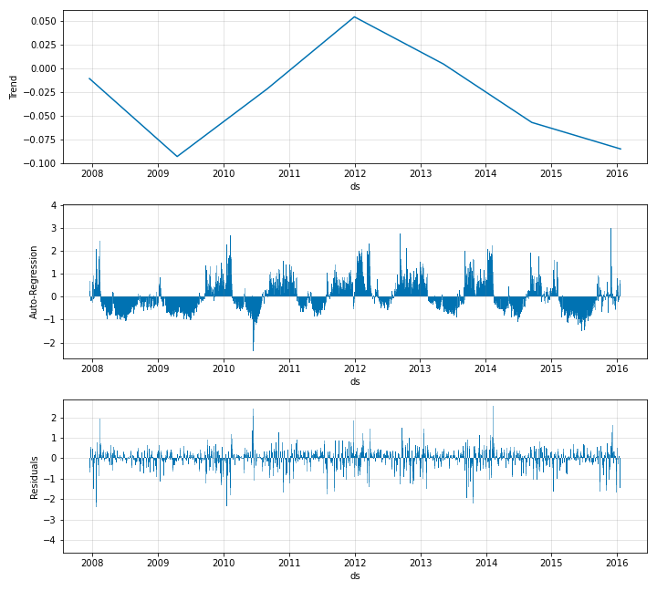
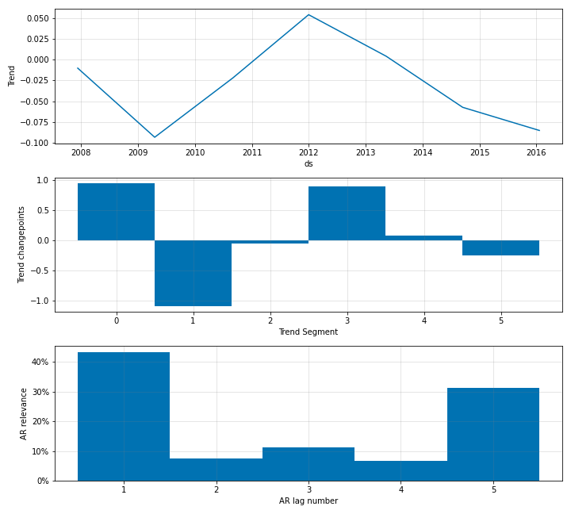

# Modelling Auto-Regression

AR-Net can be enabled in the NeuralProphet by simply setting an appropriate value to the
`n_lags` parameter of the `NeuralProphet` object.

```python
m = NeuralProphet(
    n_forecasts=3,
    n_lags=5,
    yearly_seasonality=False,
    weekly_seasonality=False,
    daily_seasonality=False,
)
```

In the above example, we create a forecasting scenario which feeds 5 lags into AR-Net and receives
3 steps as forecasts. Once you have the AR-Net enabled, during forecasting your `future_periods` value
should be equal to the `n_forecasts` value specified when creating the `NeuralProphet` object. Whichever
value you specify for `future_periods`, it will be converted to the value of `n_forecasts` with a notice
to the user. This is because, since the AR-Net is built during training such that it has an ouptut size
of `n_forecasts`, it cannot support any other value during testing.

The plotted components should look like below.

{: style="height:600px"}

You can now see auto-regression as a separate component. The corresponding coefficients look like
below.

{: style="height:600px"}

You can see the relevance of each of the lags when modelling the autocorrelation. You can also specify the `num_hidden_layers` for the AR-Net.

```python
m = NeuralProphet(
    n_forecasts=3,
    n_lags=5,
    num_hidden_layers=2,
    yearly_seasonality=False,
    weekly_seasonality=False,
    daily_seasonality=False
)
```

Regularization in AR-Net is done by setting the `ar_sparsity` parameter in the `NeuralProphet` object
like below. `ar_sparsity` should take a value in between 0-1. 

```python
m = NeuralProphet(
    n_forecasts=3,
    n_lags=5,
    num_hidden_layers=2,
    ar_sparsity=0.01,
    yearly_seasonality=False,
    weekly_seasonality=False,
    daily_seasonality=False
)
```
## Highlight Specific Forecast Step

In the multi-output mode where the model outputs a forecast horizon instead of just 1, while modelling the
autocorrelation (as described in Section [Auto-Regression](auto-regression.md)), you can highlight the nth step
ahead forecast. This means that during training, you can specifically look at the error of the nth step and
with model component plotting, 