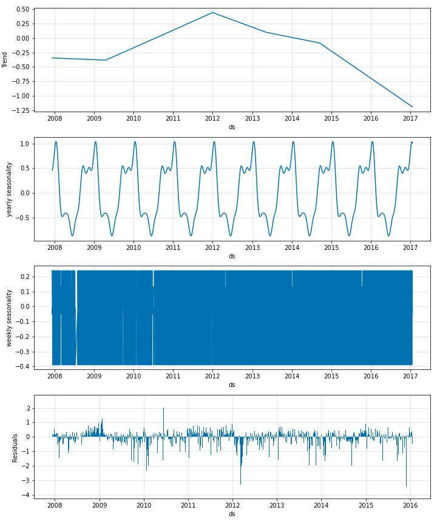

# Modelling Seasonality

Seasonality in NeuralProphet is modelled using Fourier terms. It can be specified both in additive 
and multiplicative modes.

## Additive Seasonality
The default mode for seasonality is additive. See below for a minimalistic example of additive seasonality
in NeuralProphet.

```python
m = NeuralProphet()
metrics = m.fit(df)
```

{: style="height:600px"}

You can see both the weekly and yearly seasonal shapes, although the weekly pattern is not very clear 
due to the high frequency. If you do not specify the number of Fourier terms desired for every seasonality,
the model assigns default values to them. You can also specify these numbers as in the below example.

```python
m = NeuralProphet(
    yearly_seasonality=8,
    weekly_seasonality=4
)
```

According to this example, yearly seasonal pattern will use 8 Fourier terms and the weekly seasonal pattern
will use 4 Fourier terms.

## Multiplicative Seasonality

Seasonality can also be modelled multiplicatively by setting the mode explicitly like below.

```python
m = NeuralProphet( 
    seasonality_mode='multiplicative'
)
```

## Regularize Seasonality

Just like all the other components in NeuralProphet, seasonality too can be regularized. This done
by regularizing the Fourier coefficients like below.

```python
m = NeuralProphet(
    yearly_seasonality=16,
    weekly_seasonality=8,
    daily_seasonality=False,
    seasonality_reg=1,
)
```

The value of the `seasonality_reg` parameter can take values in between 0-100. Smaller values (~0.1-1) allow the model to fit 
larger seasonal fluctuations whereas larger values (~1-100) dampen the seasonality. The default is no regularization.
 