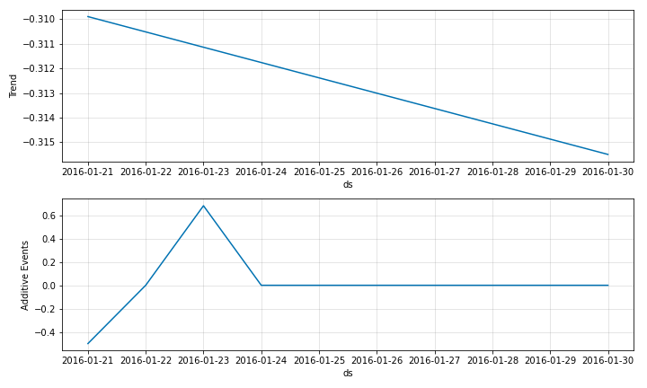
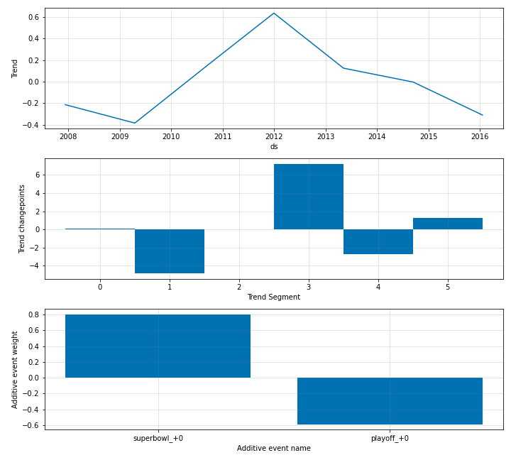
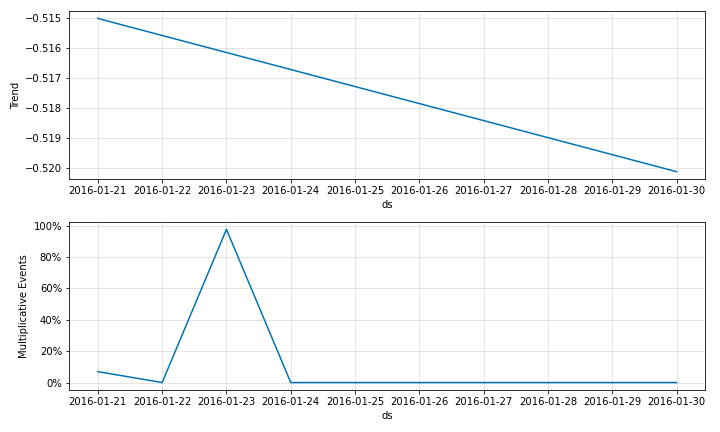
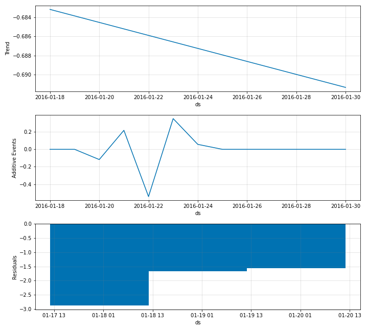
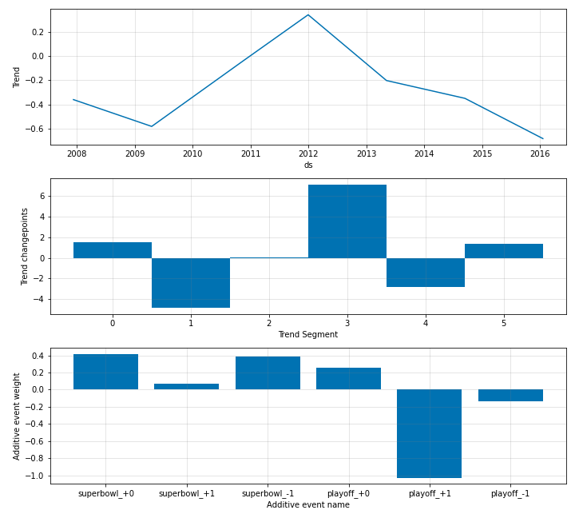
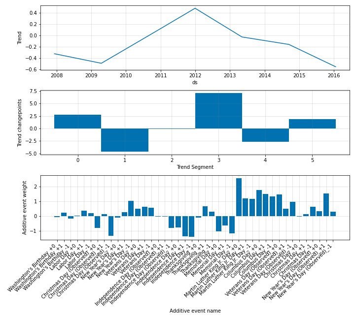

# Modelling Events

Often in forecasting problems, we need to consider recurring special events. These are supported
by `neural_prophet`. These events can be added both in additive format and multiplicative format.


To provide the information of events into the model, the user has to create a dataframe which has the 
column `ds` corresponding to the event dates and the column `event` which contains
the names of the events on specified dates. In the following example we have created the
dataframe named `history_events_df` which contains these events information.

```python
playoffs_history = pd.DataFrame({
        'event': 'playoff',
        'ds': pd.to_datetime(['2008-01-13', '2009-01-03', '2010-01-16',
                              '2010-01-24', '2010-02-07', '2011-01-08',
                              '2013-01-12', '2014-01-12', '2014-01-19',
                              '2014-02-02', '2015-01-11', '2016-01-17']),
    })

superbowls_history = pd.DataFrame({
    'event': 'superbowl',
    'ds': pd.to_datetime(['2010-02-07', '2014-02-02']),
    })
history_events_df = pd.concat((playoffs_history, superbowls_history))
```

The first few rows of the `history_events_df` dataframe looks like below. 

|    | event     | ds                  |
|---:|:----------|:--------------------|
|  0 | playoff   | 2008-01-13 00:00:00 |
|  1 | playoff   | 2009-01-03 00:00:00 |
|  2 | playoff   | 2010-01-16 00:00:00 |
|  3 | playoff   | 2010-01-24 00:00:00 |
|  4 | playoff   | 2010-02-07 00:00:00 |
|  5 | playoff   | 2011-01-08 00:00:00 |

<br />
For forecasting, we also need to provide the future dates of these events used to
train the model. You can either include these in the same events dataframe
that was created before for fitting the model, or in a new dataframe as follows. 

```python
playoffs_future = pd.DataFrame({
    'event': 'playoff',
    'ds': pd.to_datetime(['2016-01-21', '2016-02-07'])
})

superbowl_future = pd.DataFrame({
    'event': 'superbowl',
    'ds': pd.to_datetime(['2016-01-23', '2016-02-07'])
})

future_events_df = pd.concat((playoffs_future, superbowl_future))
```

Once the events dataframes have been created, the `NeuralProphet` object should be created and the
events configs should be added. This is done using the `add_events` function of the `NeuralProphet` class.

```python
m = NeuralProphet(
        n_forecasts=10,
        yearly_seasonality=False,
        weekly_seasonality=False,
        daily_seasonality=False,
    )
m = m.add_events(["superbowl", "playoff"])
```

After that, we need to convert the events data in the previously created dataframes into the binary input
data expected by the model. This can be done by calling the `create_df_with_events` function by passing
original time series dataframe along with the created `history_events_df`.

```python
history_df = m.create_df_with_events(df, history_events_df)
```
This returns a dataframe in the following format.

|      | ds                  |        y |   superbowl |   playoff |
|-----:|:--------------------|---------:|------------:|----------:|
|    0 | 2007-12-10 00:00:00 |  9.59076 |           0 |         0 |
|    1 | 2007-12-11 00:00:00 |  8.51959 |           0 |         0 |
|    2 | 2007-12-12 00:00:00 |  8.18368 |           0 |         0 |
|    3 | 2007-12-13 00:00:00 |  8.07247 |           0 |         0 |
|    4 | 2007-12-14 00:00:00 |  7.89357 |           0 |         0 |

<br />

After that, we can simply fit the model as below by providing to the `fit` function, the created `history_df`.

```python
metrics = m.fit(history_df, freq="D")
forecast = m.predict(df=history_df)
```
<The produced forecasts look like below. The 10 step-ahead forecasts are available in the yhat1 column.
The components from the individual events are available in the event_playoff and event_superbowl columns and 
their agrgegated effect is shown on the events_additive column>

Once the forecasting is done, the different components can be plotted like below. All events are plotted as one 
component, the `Additive Events`

{: style="height:400px"}

The model coefficients would look like below.   

{: style="height:550px"}

## Multiplicative Events

The default mode for events in `neural_prophet` is additive. However, events can also be modelled
in a multiplicative format. For this, when adding the events configs to the `NeuralProphet` object,
we need to set the `mode` to `multiplicative` as below.


```python
m = m.add_events(["superbowl", "playoff"], mode="multiplicative")
```
All the other steps are the same as for the `additive` mode. Now, when you plot the components,
the event components will appear as percentages.


{: style="height:400px"}

## Event Windows

You can also provide windows for events. This way, you can consider the days around a 
particular event also as special events by providing the arguments `lower_window` and 
`upper_window` as appropriate to the `add_events` function of the `NeuralProphet` object.
By default, the values for these windows are `0`, which means windows are not considered.

```python
m = m.add_events(["superbowl", "playoff"], lower_window=-1, upper_window=1)
```

According to this specification, for both `superbowl` and `playoff` events, three special events will be 
modelled, the event date, the previous day and the next day. These will be visible in the component plots as below.

{: style="height:550px"}

In the parameters plot too, there will now be `superbowl_+1` and `superbowl_-1` which correspond to the coefficients of the
day following and previous to the `superbowl` event. The `playoff` event also has the same new coefficients.
   
{: style="height:550px"}


If you want to define different windows for the individual events, this can also be done as follows.

```python
m = m.add_events("superbowl", lower_window=-1, upper_window=1)
m = m.add_events("playoff", upper_window=2)
```

In the above example, for the `playoff` event, the specified event date, as well as the two following dates
are considered as three different special events.

## Country Specific Holidays

Apart from the user specified events, `neural_prophet` also supports standard country specific holidays.
If you want to add the holidays for a particular country, you simply have to call the `add_country_holidays`
function on the `NeuralProphet` object and specify the country. Similar to the user specified events,
country specific holidays can either be `additive` or `multiplicative` and include windows. However,
unlike for user specified events, the windows will be the same for all the country specific events. 

```python
m = m.add_country_holidays("US", mode="additive", lower_window=-1, upper_window=1)
```

This example will add all the `US` holidays into the model in `additive` format. The coefficients of the
individual events will now look like below.

{: style="height:600px"}

## Regularization for Events

Events can also support regularization of the coefficients. You can specify the regularization
when adding the event configs into the `NeuralProphet` object like below.

```python
m = m.add_events(["superbowl", "playoff"], regularization=0.05)
```

The regularization for the individual events can also be different from each other like below.

```python
m = m.add_events("superbowl", regularization=0.05)
m = m.add_events("playoff", regularization=0.03)
```

For the country specific holidays too, regularizations can be specified like below.

```python
m = m.add_country_holidays("US", mode="additive", regularization=0.05)
```