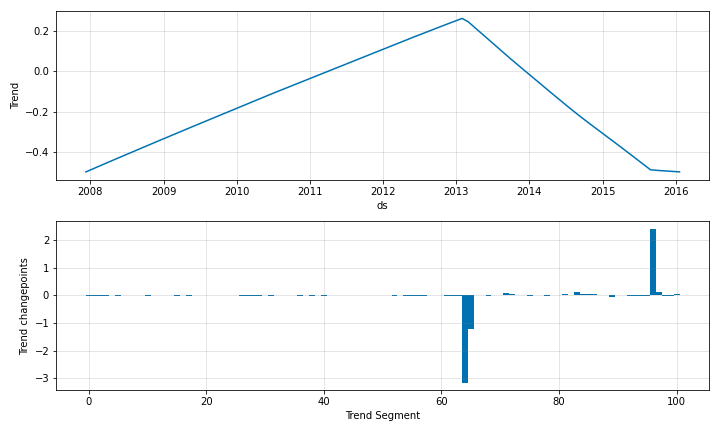

# Modelling Trend

This is a minimalistic example of trend modelling in Neuralprophet by defining changepoints.
 
```python
m = NeuralProphet(
    n_changepoints=100,
    trend_reg=2, 
    yearly_seasonality=False,
    weekly_seasonality=False,
    daily_seasonality=False,
)
metrics = m.fit(df, freq="D")

```

```python
future = m.make_future_dataframe(df, periods=365, n_historic_predictions=len(df))
forecast = m.predict(future)
```

The components plot looks like below with only trend and residuals as a components.

{: style="height:400px"}

The coefficients plot should show the coefficients corresponding to the 100 changepoints.

{: style="height:400px"}

