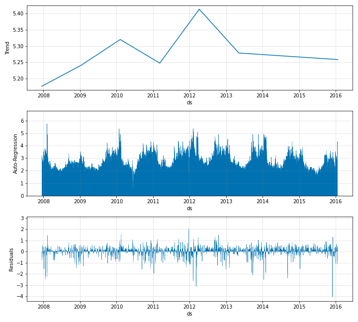
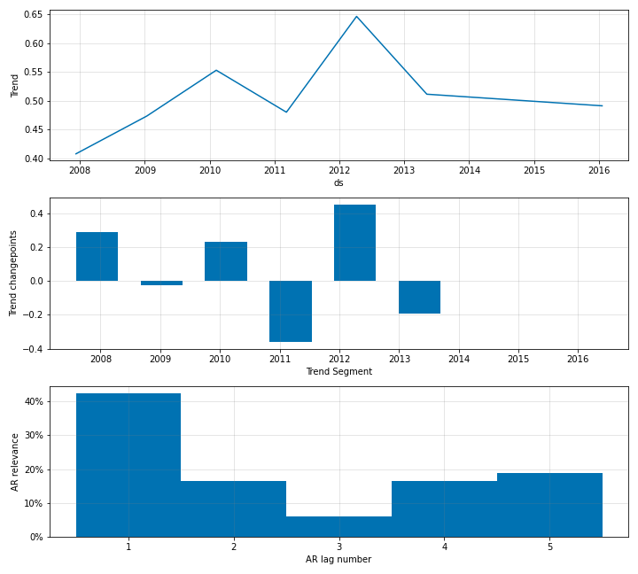

# Modelling Auto-Regression

AR-Net can be enabled in the NeuralProphet by simply setting an appropriate value to the
`n_lags` parameter of the `NeuralProphet` object.

```python
m = NeuralProphet(
    n_forecasts=3,
    n_lags=5,
    yearly_seasonality=False,
    weekly_seasonality=False,
    daily_seasonality=False,
)
```

In the above example, we create a forecasting scenario which feeds 5 lags into AR-Net and receives
3 steps as forecasts. Once you have the AR-Net enabled, during forecasting your `future_periods` value
should be equal to the `n_forecasts` value specified when creating the `NeuralProphet` object. Whichever
value you specify for `future_periods`, it will be converted to the value of `n_forecasts` with a notice
to the user. This is because, since the AR-Net is built during training such that it has an ouptut size
of `n_forecasts`, it cannot support any other value during testing.

The plotted components should look like below.

{: style="height:600px"}

You can now see auto-regression as a separate component. The corresponding coefficients look like
below.

{: style="height:600px"}

You can see the relevance of each of the lags when modelling the autocorrelation. You can also specify the `num_hidden_layers`
for the AR-Net, in order to increase the complexity of the AR-Net.

```python
m = NeuralProphet(
    n_forecasts=3,
    n_lags=5,
    num_hidden_layers=2,
    yearly_seasonality=False,
    weekly_seasonality=False,
    daily_seasonality=False
)
```

## Regularize AR-Net

Regularization in AR-Net is done by setting the `ar_sparsity` parameter in the `NeuralProphet` object
like below. For more details on setting a value for `ar_sparsity`, refer to the Section on
[Hyperparameter Selection](../hyperparameter-selection.md#regularization-related-parameters).

```python
m = NeuralProphet(
    n_forecasts=3,
    n_lags=5,
    num_hidden_layers=2,
    ar_sparsity=0.01,
    yearly_seasonality=False,
    weekly_seasonality=False,
    daily_seasonality=False
)
```
## Highlight Specific Forecast Step

When modelling the autocorrelation, the model in the multi-input, multi-output mode. In this mode, you can highlight the nth step
ahead forecast. This means that, you can specifically look at the forecast at the nth step when calculating errors during model training
as well as when forecast plotting. This can be done like below.

```python
m = NeuralProphet(
    n_forecasts=30,
    n_lags=60,
    yearly_seasonality=False,
    weekly_seasonality=False,
    daily_seasonality=False
)
m.highlight_nth_step_ahead_of_each_forecast(step_number=m.n_forecasts)
```
You can specify any value less than or equal to `n_forecasts` to the `step_number` parameter.
Once you do this, the metrics would look like below.

| SmoothL1Loss	|MAE|	SmoothL1Loss-3|	MAE-3|	RegLoss|
|:----------|:-------:|:-------:|:-------:|-------:|
|	0.272427|3.063127|0.164296|2.407697|	0.0|
|	0.151259|2.303768|0.144811|2.261525|	0.0|
|	0.129990|2.140769|0.127703|2.126293|    0.0|
|	0.116178|2.020397|0.113719|2.005068|    0.0|
|	0.104502|1.915078|0.101155|1.887193|    0.0|

<br />

In the forecast plots, it will focus only on the nth step ahead forecast. This is shown below for the fir of the model.

{: style="height:400px"}
