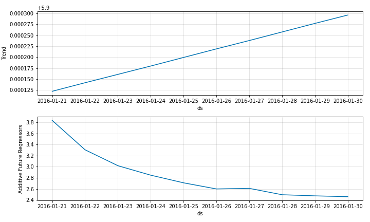
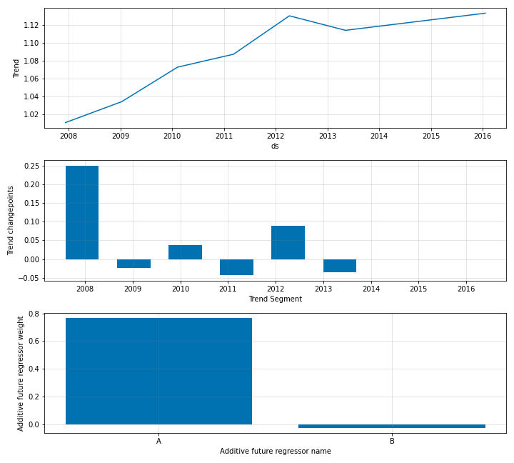

# Modelling Future Regressors

---
**NOTE**

Future Regressors have to be known for the entire forecast horizon, e.g. `n_forecasts` into the future.

---

Future regressors are the external variables which have known future values. In that sense, the
future regressors functionality if very similar to special events.

The past values of these regressors corresponding to the training time stamps, have to be provided along
with the training data itself. See below for an example where we create two dummy regressors `A` and `B` by
taking rolling means of the original data.

```python
df['A'] = df['y'].rolling(7, min_periods=1).mean()
df['B'] = df['y'].rolling(30, min_periods=1).mean()

```
The dataframe created likewise, should look like below.

|      | ds         |        y |        A |        B |
|-----:|:-----------|---------:|---------:|---------:|
|    0 | 2007-12-10 |  9.59076 |  9.59076 |  9.59076 |
|    1 | 2007-12-11 |  8.51959 |  9.05518 |  9.05518 |
|    2 | 2007-12-12 |  8.18368 |  8.76468 |  8.76468 |
|    3 | 2007-12-13 |  8.07247 |  8.59162 |  8.59162 |
|    4 | 2007-12-14 |  7.89357 |  8.45201 |  8.45201 |

<br />
In order to perform forecasting, we also need to provide the future values of the regressors.

```python
future_regressors_df = pd.DataFrame(data={'A': df['A'][:50], 'B': df['B'][:50]})
```

This dataframe looks like below.

|    |       A |       B |
|---:|--------:|--------:|
|  0 | 9.59076 | 9.59076 |
|  1 | 9.05518 | 9.05518 |
|  2 | 8.76468 | 8.76468 |
|  3 | 8.59162 | 8.59162 |
|  4 | 8.45201 | 8.45201 |

<br />

It is a dataframe with only the columns of the future values of the regressors.

Similar to events, future regressors too can be added in both the additive and multiplicative formats.

## Additive Future Regressors
The default mode for future regressors in `neural_prophet` is additive. The regressors have to be added to
the `NeuralProphet` object by calling the `add_future_regressor` function. Once this is done, the model can be
fitted by providing to the `fit` function, the dataframe of the training data as well as the regressor values.

```python
m = NeuralProphet(
        n_forecasts=10,
        yearly_seasonality=False,
        weekly_seasonality=False,
        daily_seasonality=False,
    )

m = m.add_future_regressor(name='A')
m = m.add_future_regressor(name='B')

metrics = m.fit(df)
forecast = m.predict(df)
```

Now you can plot the components the same way as before and the resulting plot would look something
like below.

```python
fig_comp = m.plot_components(forecast)
```

{: style="height:400px"}

In addition to the trend it also shows a plot for the additive future regressors.
The coefficients of the future regressors can also be plotted.

```python
fig_param = m.plot_parameters()
```
{: style="height:550px"}

## Multiplicative Future Regressors

Future regressors can also be added in multiplicative mode. You simply need to set
the mode to `multiplicative` when adding the regressors to the `NeuralProphet` object.

```python
m = m.add_future_regressor(name='A', mode="multiplicative")
m = m.add_future_regressor(name='B')
```

In the above example, we have both additive and multiplicative regressors, where `A`
is multiplicative and `B` is additive. All the other steps in the fitting and the forecasting
processes are the same.

<The components plot looks as below. There are two individual plots for the additive and multiplicative regressors, where
the multiplicative component is shown as a percentage. In the same manner, the
coefficients will appear in a plot like below.>

## Regularization for Future Regressors

We can add regularization into the future regressors as below.

```python
m = m.add_future_regressor(name='A', regularization=0.05)
m = m.add_future_regressor(name='B', regularization=0.02)
```

This will add sparsity into the individual regressor coefficients.
