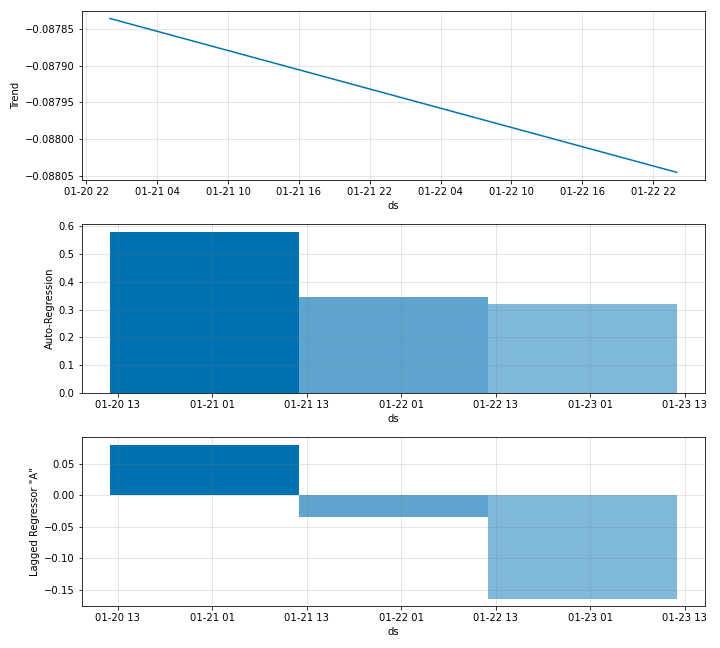

# Modelling Lagged Regressors

In the current state of NeuralProphet development, Lagged Regressor support is
only available when the AR-Net is enabled. This is because they are both handled in a similar way internally
using Feed-Forward Neural Networks and need to specify the `n_lags` value. For simplicity, at the moment
we use the same `n_lags` value for both the AR-Net and the Lagged Regressors. Therefore, with Lagged Regressors,
the NeuralProphet object is instantiated similar with AR-Net like below.

```python
m = NeuralProphet(
    n_forecasts=3,
    n_lags=5,
    yearly_seasonality=False,
    weekly_seasonality=False,
    daily_seasonality=False,
)
```

When fitting the model, the dataframe provided to the `fit` function should have additional
columns for your lagged regressors like below.

|      | ds                  |        y |        A |
|-----:|:--------------------|---------:|---------:|
|    0 | 2007-12-10 00:00:00 |  9.59076 |  9.59076 |
|    1 | 2007-12-11 00:00:00 |  8.51959 |  9.05518 |
|    2 | 2007-12-12 00:00:00 |  8.18368 |  8.76468 |
|    3 | 2007-12-13 00:00:00 |  8.07247 |  8.59162 |
|    4 | 2007-12-14 00:00:00 |  7.89357 |  8.45201 |

<br />

In this example, we have a Lagged Regressor named `A`. You also need to register these
Lagged Regressors with the `NeuralProphet` object by calling the `add_lagged_regressor` function
and giving the necessary configs.

```python
m = m.add_lagged_regressor(names='A')
```
By setting the `only_last_value` argument of the `add_lagged_regressor` function, the user can
specify either to use only the last known value of the regressor within the input window or
else use the same number of lags as auto-regression. Now you can perform the model fitting and forecasting as usual.
The plotted components should look
like below.

{: style="height:500px"}

You can see the components corresponding to both auto-regression and the Lagged Regressor `A`.
The coefficients plot looks like below.


{: style="height:700px"}

It shows both the AR and Lagged Regressor relevance at the 5 lags corresponding to the input window.

<Lagged regressors too can be regularized. This is done by specifying the required regularization
strength when registering the lagged regressors with the NeuralProphet object as below.>
