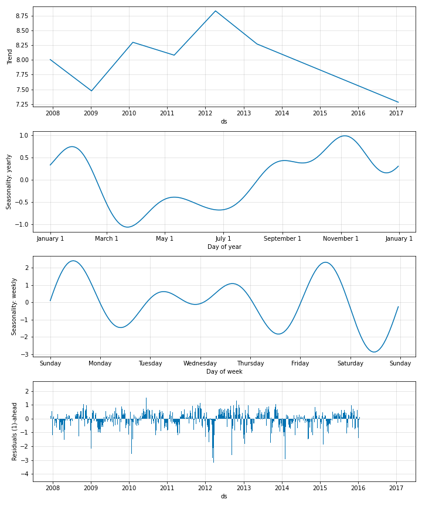
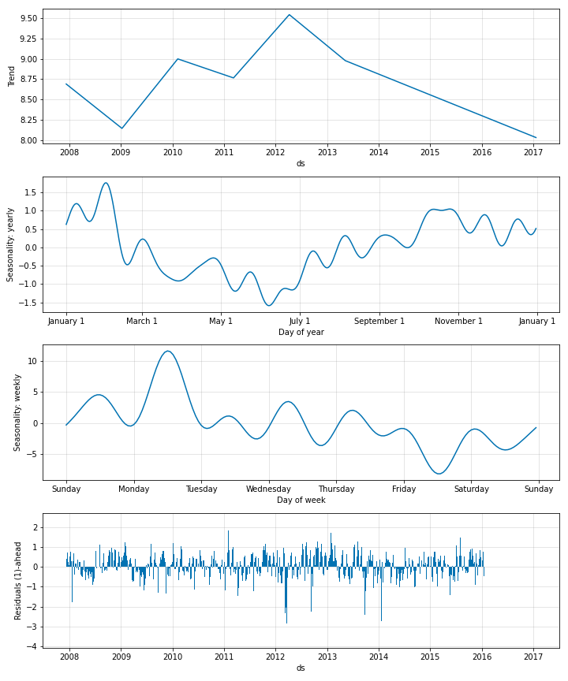

# Modelling Seasonality

Seasonality in NeuralProphet is modelled using Fourier terms. It can be specified both in additive
and multiplicative modes.

## Additive Seasonality
The default mode for seasonality is additive. See below for a minimalistic example of additive seasonality
in NeuralProphet.

```python
m = NeuralProphet()
metrics = m.fit(df)
```

{: style="height:600px"}

You can see both the weekly and yearly seasonal shapes. Since required seasonality is not explicitly stated in the
model development, NeuralProphet fits any seasonality that is possible with the data. The model also assigns default
values to the number of Fourier terms desired for every seasonality. You can also specify these numbers as in the below example.

```python
m = NeuralProphet(
    yearly_seasonality=8,
    weekly_seasonality=3
)
```

According to this example, yearly seasonal pattern will use 8 Fourier terms and the weekly seasonal pattern
will use 3 Fourier terms. By playing around with the number of Fourier terms, you can either underfit or overfit the
seasonality. Below is an example where the seasonality is overfitted for the same data, with a high number of Fourier terms
for each seasonality.

```python
m = NeuralProphet(
    yearly_seasonality=16,
    weekly_seasonality=8
)
```
{: style="height:600px"}


## Multiplicative Seasonality

Seasonality can also be modelled multiplicatively by setting the mode explicitly like below.
By doing this, the seasonality will be multiplicative with respect to the trend.

```python
m = NeuralProphet(
    seasonality_mode='multiplicative'
)
```

## Regularize Seasonality

Just like all the other components in NeuralProphet, seasonality too can be regularized. This is done
by regularizing the Fourier coefficients like below. For the details on how to set the `seasonality_reg` parameter,
refer to the Section on [Hyperparameter Selection](../hyperparameter-selection.md#regularization-related-parameters).

```python
m = NeuralProphet(
    yearly_seasonality=16,
    weekly_seasonality=8,
    daily_seasonality=False,
    seasonality_reg=1,
)
```
