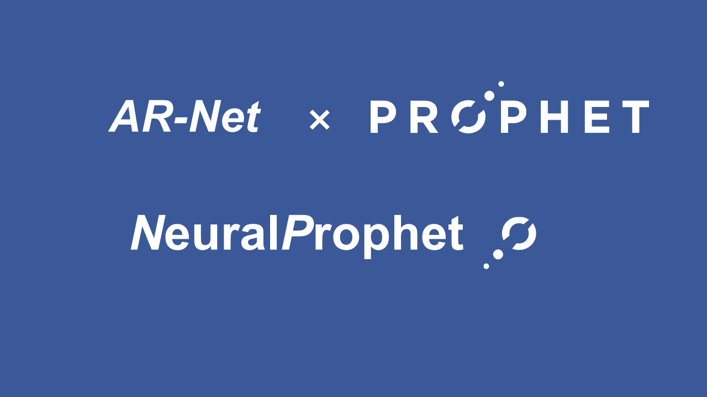

# neuralprophet-doc-zh
NeuralProphet中文文档

# 说明

NeuralProphet是一个Facebook Prophet和AR-Net的启发，在PyTorch上构建的基于神经网络的时间序列模型，目前处于开发阶段。NeuralProphet是在一个完全模块化的架构中开发的，这使得它可以在未来添加任何额外的组件。我们的愿景是为用户开发一个简单易用的预测工具，同时保留Prophet的原始目标，如可解释性、可配置性，并通过使用PyTorch作为后端提供更多的功能，如自动差分功能。

------

本文档是对其官方文档的中文翻译。水平有限，如有翻译不当之处敬请指正！

建议在**语雀**上阅读，效果好。

- 本文档在语雀地址：https://www.yuque.com/alipayqgthu1irbf/neuralprophet

- 本文档GitHub地址：https://github.com/SharkFin-top/neuralprophet-doc-zh

------

NeuralProphet官方地址：

- GitHub：https://github.com/ourownstory/neural_prophet
- Document：http://neuralprophet.com/

------

PS: 封面图是我自己理解，在Facebook Prophet基础上设计的logo，还不错吧 ヾ(◍°∇°◍)ﾉﾞ

------

此外，

Prophet中文文档：https://github.com/SharkFin-top/prophet-doc-zh

更多内容：https://www.yuque.com/alipayqgthu1irbf/sharkfin
