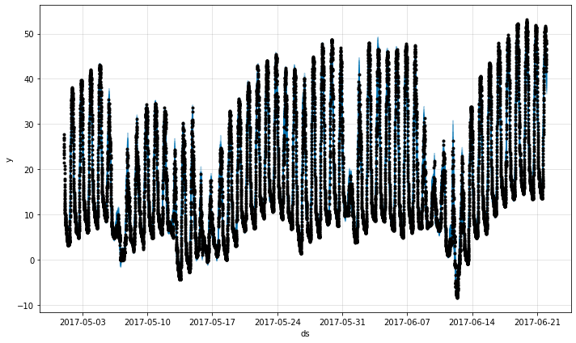

# Corssvalidation


```python
if 'google.colab' in str(get_ipython()): 
    !pip install git+https://github.com/ourownstory/neural_prophet.git # may take a while 
    #!pip install neuralprophet # much faster, but may not have the latest upgrades/bugfixes
    data_location = "https://raw.githubusercontent.com/ourownstory/neural_prophet/master/" 
else: 
    data_location = "../"
```


```python
from collections import namedtuple 
import pandas as pd 
import matplotlib.pyplot as plt 
from neuralprophet import NeuralProphet, set_log_level set_log_level("ERROR")
```


```python
Experiment = namedtuple('Experiment', ['data', 'freq', 'model_config'])
experiments = [
    Experiment(
        data="air_passengers.csv",
        freq="MS",
        model_config={"seasonality_mode":"multiplicative"},
    ),
    Experiment(
        data="wp_log_peyton_manning.csv",
        freq="D",
        model_config={"n_changepoints": 50},
    ),
    Experiment(
        data="yosemite_temps.csv",
        freq="5min",
        model_config={"n_forecasts": 12, "n_lags": 36},
    ),
]
```


```python
def run_experiment(e, plot=False):
    df = pd.read_csv(data_location + "example_data/" + e.data)
    print(" ---- running exp: {} (len: {}) ----".format(e.data, len(df)))
    folds = NeuralProphet(**e.model_config).crossvalidation_split_df(df, freq=e.freq, k=3, fold_pct=0.2, fold_overlap_pct=0.0)
    train, val = [], []
    for df_train, df_val in folds:
        m = NeuralProphet(**e.model_config)
        metrics_train = m.fit(df_train, freq=e.freq, plot_live_loss=False)
        metrics_val = m.test(df_val)
        train.append(metrics_train["MAE"].values[-1])
        val.append(metrics_val["MAE"].values[-1])
    if plot:
        future = m.make_future_dataframe(df_train, periods=len(df_val), n_historic_predictions=len(df_train))
        forecast = m.predict(future)
        fig = m.plot(forecast)
        plt.show()
    print("train MAE:", train)
    print("val MAE:", val)
    print("train MAE (avg):", sum(train)/len(train))
    print("val MAE (avg):", sum(val)/len(val))
```


```python
for exp in experiments:
    run_experiment(exp, plot=True)
```

The plotted components should look like below.
{: style="height:500px"}

{: style="height:500px"}

{: style="height:500px"}
