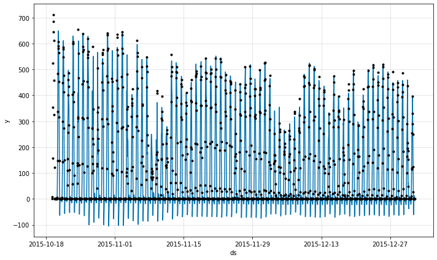
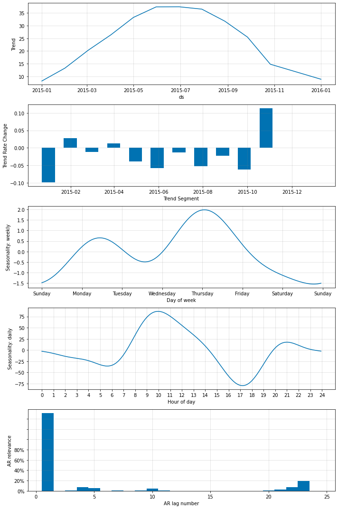
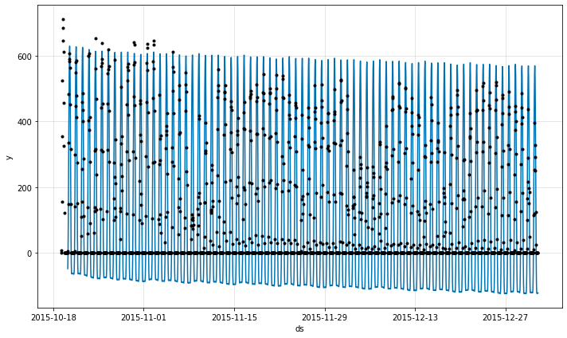
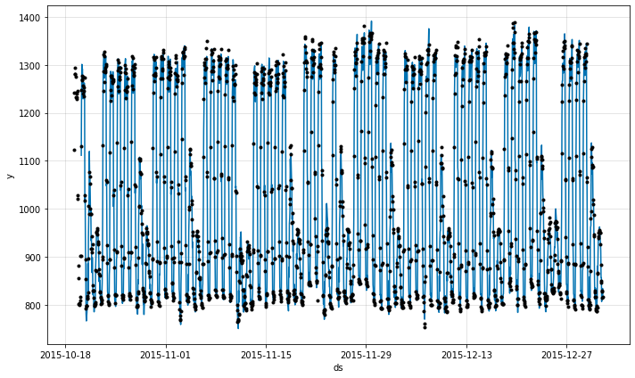

# Energy_data_example

```python
if 'google.colab' in str(get_ipython()):
    !pip install git+https://github.com/ourownstory/neural_prophet.git # may take a while
    #!pip install neuralprophet # much faster, but may not have the latest upgrades/bugfixes
    data_location = "https://raw.githubusercontent.com/ourownstory/neural_prophet/master/energy/"
else:
    data_location = "../"
```

# Example on PV forecasting dataset
In this first section, we will train a 1-step ahead forecaster on solar irradiance data (that can be a proxy for solar PV production). We can train this forecaster considering the privious 24 steps and letting neuralprophet automatically chooses the other parameters.

The paramters that we can modify are for the AR sparsity and the neural network architecture

The training will occur on 80% of the data, reserving the last 20% for the validation.

```python
import pandas as pd
from neuralprophet import NeuralProphet, set_log_level
# set_log_level("ERROR")
files = ['SanFrancisco_PV_GHI.csv', 'SanFrancisco_Hospital.csv']
raw = pd.read_csv(data_location + files[0])
df=pd.DataFrame()
df['ds'] = pd.date_range('1/1/2015 1:00:00', freq=str(60) + 'Min',
                               periods=(8760)) 
df['y'] = raw.iloc[:,0].values

df.head(3)
```

The format of the data looks like below.

ds | y | 
------------|------------| -------------|
0|2015-01-01 01:00:00|0|
1|2015-01-01 02:00:00|0|
2|2015-01-01 03:00:00|0|

```python
m = NeuralProphet(
    n_lags=24,
    ar_sparsity=0.5,
    #num_hidden_layers = 2,
    #d_hidden=20,
)
metrics = m.fit(df, freq='H', valid_p = 0.2)
```

```python
df_train, df_val = m.split_df(df, freq='H',valid_p=0.2)
m.test(df_val)
```

SmoothL1Loss|MAE | MSE | 
------------|------------ | ------------- |
0|0.001396|28.061516|2122.506974

```python
future = m.make_future_dataframe(df_val, n_historic_predictions=True)
forecast = m.predict(future)
fig = m.plot(forecast)
```
{: style="height:350px"}

```python
fig_comp = m.plot_components(forecast)
```
{: style="height:350px"}

```python
fig_param = m.plot_parameters()
```
{: style="height:350px"}

```python
fig_fit = m.highlight_nth_step_ahead_of_each_forecast(1).plot(forecast)
```
{: style="height:350px"}

```python
fig_prediction = m.plot_last_forecast(forecast, include_previous_forecasts=48)
```
{: style="height:350px"}

There is something to consider here, if we consider a neural network with at least one hidden layer. For a high enough learning rate (probably > 0.1), the gradient seems to vanish and forces the AR net output to 0.

From below, we can see that the forecast output has a strange behavior. it looks like the output is exactly the sum of the weekly, daily seasonlality with trend. With no noise and changes at all.

```python
m = NeuralProphet(
    n_lags=24,
    ar_sparsity=0.5,
    num_hidden_layers = 2,
    d_hidden=20,
    learning_rate = 0.1
)
metrics = m.fit(df, freq='H', valid_p = 0.2)
```

```python
future = m.make_future_dataframe(df_val, n_historic_predictions=True)
forecast = m.predict(future)
fig = m.plot(forecast)
```
{: style="height:350px"}

An easy fix is to set the learning rate at a low enough value.

```python
m = NeuralProphet(
    n_lags=24,
    ar_sparsity=0.5,
    num_hidden_layers = 2,
    d_hidden=20,
    learning_rate = 0.001
)
metrics = m.fit(df, freq='H', valid_p = 0.2)
```
```python
future = m.make_future_dataframe(df_val, n_historic_predictions=True)
forecast = m.predict(future)
fig = m.plot(forecast)
```
{: style="height:350px"}

## Example on load forecasting
We can train a forecaster on another commom energy problem. In this, case we are training a 1-step ahead forecaster to predict the electricity consumption of a building. We use a similar NeuralProphet model as we used for the PV forecasting.

```python
import pandas as pd
from neuralprophet import NeuralProphet, set_log_level
# set_log_level("ERROR")
files = ['SanFrancisco_PV_GHI.csv', 'SanFrancisco_Hospital.csv']
raw = pd.read_csv(data_location + files[1])

df=pd.DataFrame()
df['ds'] = pd.date_range('1/1/2015 1:00:00', freq=str(60) + 'Min',
                               periods=(8760)) 
df['y'] = raw.iloc[:,0].values

df.head(3)
```
ds | y | 
------------|------------ | ------------- |
0|2015-01-01 01:00:00|778.007969|
1|2015-01-01 02:00:00|776.241750|
2|2015-01-01 03:00:00|779.357338|

```python
print(raw)
```

Electricity:Facility [kW](Hourly)|
------------|------------ |
0| 778.007969
1|776.241750
2|779.357338
3|778.737196
4|787.835835
...|...
8755|845.563081
8756|827.530521
8757|829.256300
8758|813.937205
8759|815.588584

```python
m = NeuralProphet(
    n_lags=24,
    ar_sparsity=0.5,
    num_hidden_layers = 2,
    d_hidden=20,
    learning_rate=0.001
)
metrics = m.fit(df, freq='H', valid_p = 0.2)
```

```python
df_train, df_val = m.split_df(df, freq='H',valid_p=0.2)
m.test(df_val)
```

SmoothL1Loss|MAE | MSE | 
------------|------------ | ------------- |
0|0.00052|13.703728|374.965097

```python
future = m.make_future_dataframe(df_val, n_historic_predictions=True)
forecast = m.predict(future)
fig = m.plot(forecast)
```
{: style="height:350px"}

```python
fig_comp = m.plot_components(forecast)
```
{: style="height:350px"}

```python
fig_param = m.plot_parameters()
```
{: style="height:350px"}

```python
fig_fit = m.highlight_nth_step_ahead_of_each_forecast(1).plot(forecast)
```
{: style="height:350px"}

```python
fig_prediction = m.plot_last_forecast(forecast, include_previous_forecasts=48)
```
{: style="height:350px"}