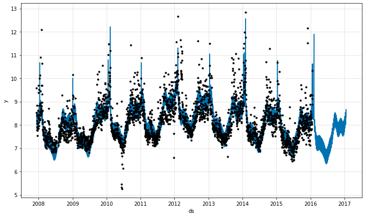

# Modeling Holidays and Special Events

If you have holidays or other recurring events that you’d like to model, you must create a dataframe for them. It has two columns (`event` and `ds`) and a row for each occurrence of the holiday. It must include all occurrences of the holiday, both in the past (back as far as the historical data go) and in the future (out as far as the forecast is being made). If they won’t repeat in the future, Prophet will model them and then not include them in the forecast.

Events can be added as either additive or multiplicative components.

Windows can additionally be defined to include days before/after the event.

We will use the time series of the log daily page views for the Wikipedia page for Peyton Manning as an example.
First, we load the data:

```python
if 'google.colab' in str(get_ipython()):
    !pip install git+https://github.com/ourownstory/neural_prophet.git # may take a while
    #!pip install neuralprophet # much faster, but may not have the latest upgrades/bugfixes
    data_location = "https://raw.githubusercontent.com/ourownstory/neural_prophet/master/"
else:
    data_location = "../"
```

```python
import pandas as pd
from neuralprophet import NeuralProphet
```

```python
df = pd.read_csv(data_location + "example_data/wp_log_peyton_manning.csv")
```

Here we create a dataframe that includes the dates of all of Peyton Manning’s playoff appearances, including past events and future events:

```python
## user specified events
# history events
playoffs = pd.DataFrame({
    'event': 'playoff',
    'ds': pd.to_datetime([
        '2008-01-13', '2009-01-03', '2010-01-16',
        '2010-01-24', '2010-02-07', '2011-01-08',
        '2013-01-12', '2014-01-12', '2014-01-19',
        '2014-02-02', '2015-01-11', '2016-01-17',
        '2016-01-24', '2016-02-07',
    ]),
})

superbowls = pd.DataFrame({
    'event': 'superbowl',
    'ds': pd.to_datetime([
        '2010-02-07', '2012-02-05', '2014-02-02', 
        '2016-02-07',
    ]),
})

events_df = pd.concat((playoffs, superbowls))
```

```python
# NeuralProphet Object
m = NeuralProphet(loss_func="MSE")

# set the model to expect these events
m = m.add_events(["playoff", "superbowl"])

# create the data df with events
history_df = m.create_df_with_events(df, events_df)
```
```python
# fit the model
metrics = m.fit(history_df, freq="D")
```

```python
# forecast with events
future = m.make_future_dataframe(history_df, events_df, periods=30, n_historic_predictions=len(df))
forecast = m.predict(df=future)
```

The events effect can be seen in the forecast dataframe:
```python
events = forecast[(forecast['event_playoff'].abs() + forecast['event_superbowl'].abs()) > 0]
events.tail()
```


ds|y|yhat1|residual1|trend|season_yearly|season_weekly|events_additiveevent_playoff|event_superbowl
----| ----|----|----|----|----|----|----|----|
2190|2014-02-02|11.760520|11.607304|-0.153216|8.150120|0.820481|-0.007527|2.644229|1.061683|1.582546|
2532|2015-01-11|9.886596|9.915270|0.028674|7.921124|0.939990|-0.007527|1.061683|1.061683|0.000000|
2901|2016-01-17|9.273878|9.768520|0.494642|7.673433|1.040930|-0.007527|1.061683|1.061683|0.000000|
2908|2016-01-24|NaN|9.770431|NaN|7.668760|1.047514|-0.007527|1.061683|1.061683|0.000000|
2922|2016-02-07|NaN|10.931586|NaN|7.659413|0.635471|-0.007527|2.644229|1.061683|1.582546|

The events effects will also show up in the plots, where we see that there is a spike on the days around playoff appearances, with an especially large spike for the superbowl:

```python
## plotting forecasts
fig = m.plot(forecast)
```
{: style="height:350px"}

```python
## plotting components
fig_comp = m.plot_components(forecast)
```

{: style="height:350px"}

```python
## plotting parameters
fig_param = m.plot_parameters()
```

{: style="height:350px"}

## Event Windows
You can also include the arguments `lower_window` and `upper_window` which extend the holiday out to `[lower_window, upper_window]` days around the date. 

For instance, if you wanted to include Christmas Eve in addition to Christmas you’d include `lower_window=-1, upper_window=0`. If you wanted to use Black Friday in addition to Thanksgiving, you’d include `lower_window=0, upper_window=1`. 

```python
m = NeuralProphet(loss_func="MSE")

# set event configs to NeuralProphet object with windows
m = m.add_events(["playoff"], upper_window=1)
m = m.add_events(["superbowl"], lower_window=-1, upper_window=1)

# create the data df with events
history_df = m.create_df_with_events(df, events_df)

# fit the model
metrics = m.fit(history_df, freq="D")
```

```python
# make future dataframe with events known in future
future = m.make_future_dataframe(df=history_df, events_df=events_df, periods=365, n_historic_predictions=len(df))
forecast = m.predict(df=future)
```

```python
## plotting parameters
fig = m.plot(forecast)
fig_param = m.plot_parameters()
```
{: style="height:350px"}

{: style="height:350px"}

## Multiplicative Events

```python
m = NeuralProphet(loss_func="MSE")

# set event configs to NeuralProphet object with windows
m = m.add_events(["playoff"], upper_window=1)
m = m.add_events(["superbowl"], lower_window=-1, upper_window=1, mode="multiplicative")

# create the data df with events
history_df = m.create_df_with_events(df, events_df)

# fit the model
metrics = m.fit(history_df, freq="D")
```

```python
# make future dataframe with events known in future
future = m.make_future_dataframe(history_df, events_df, periods=30, n_historic_predictions=len(df))
forecast = m.predict(df=future)
```

```python
## plotting components
fig_comp = m.plot(forecast)
```
{: style="height:350px"}

```python
# plot parameters
fig_param = m.plot_parameters()
```

{: style="height:350px"}

## Country Specific Holidays

```python
m = NeuralProphet()

# add the country specific holidays
m = m.add_country_holidays("US")

# fit the model
metrics = m.fit(df, freq="D")
```

```python
# make future dataframe with events known in future
future = m.make_future_dataframe(df=df, periods=30, n_historic_predictions=len(df))
forecast = m.predict(df=future)
```

```python
## plotting components
fig = m.plot(forecast)
fig_param = m.plot_parameters()
```
{: style="height:350px"}

{: style="height:350px"}
