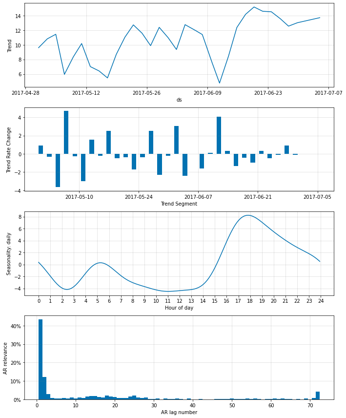
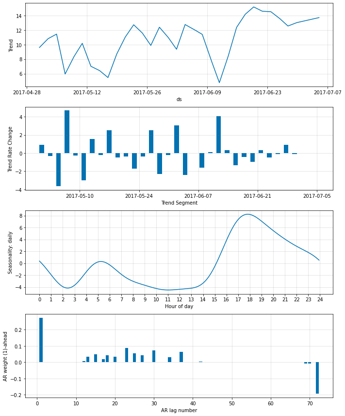
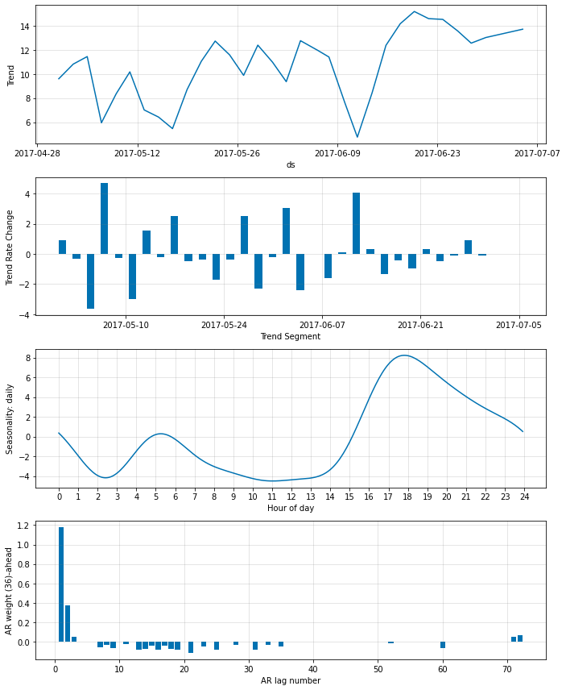
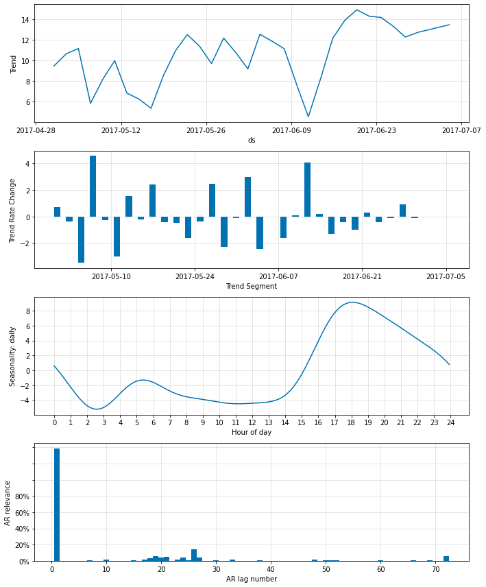
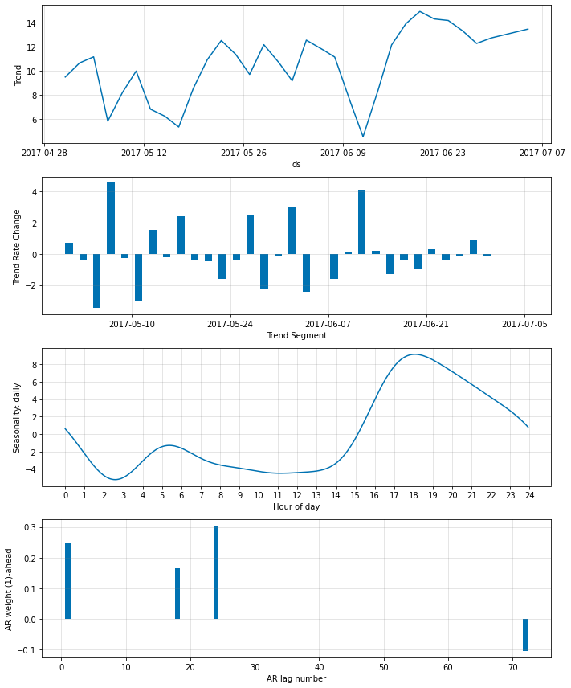
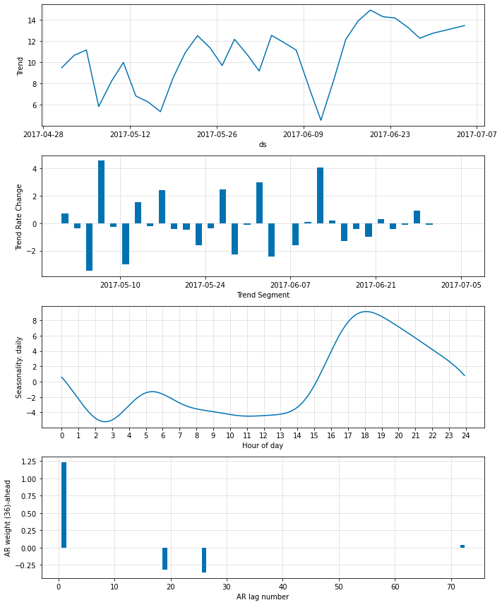
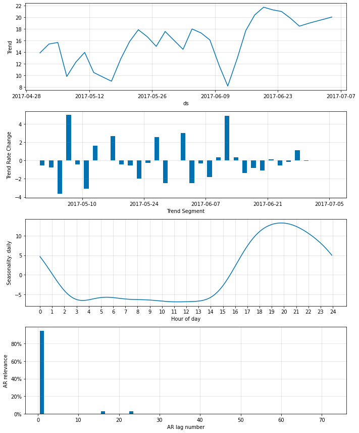
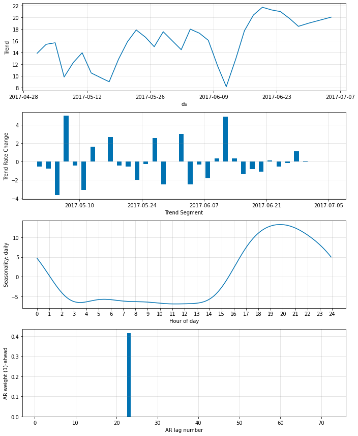
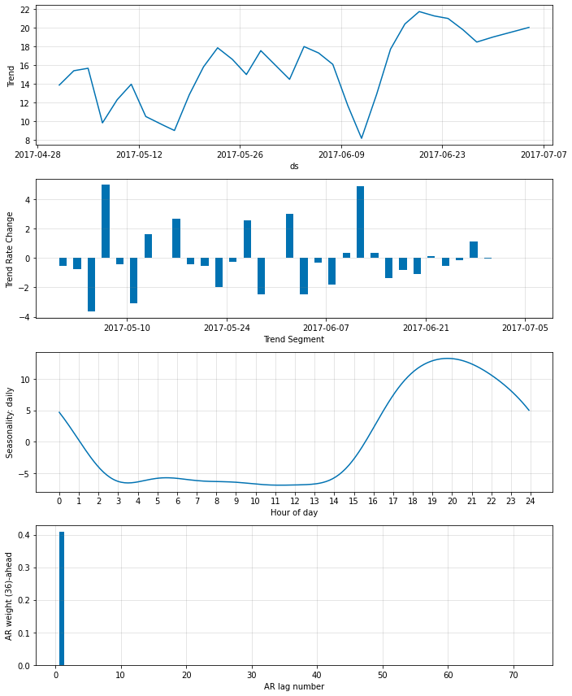

# Sparse Autoregression
Here we fit NeuralProphet to data with 5-minute resolution (daily temperatures at Yosemite). 
This is a continuation of the example notebook `autoregression_yosemite_temps`, focusing on sparsity.

```python
if 'google.colab' in str(get_ipython()):
    !pip install git+https://github.com/ourownstory/neural_prophet.git # may take a while
    #!pip install neuralprophet # much faster, but may not have the latest upgrades/bugfixes
    data_location = "https://raw.githubusercontent.com/ourownstory/neural_prophet/master/"
else:
    data_location = "../"
```

```python
import pandas as pd
from neuralprophet import NeuralProphet, set_log_level
set_log_level("ERROR")
df = pd.read_csv(data_location + "example_data/yosemite_temps.csv")
# df.head(3)
```

# Sparsifying the AR coefficients
The autoregression component of NeuralProphet is defined as a AR-Net ([paper](https://arxiv.org/abs/1911.12436), [github](https://github.com/ourownstory/AR-Net)).
Thus, we can set `ar_sparsity` to a number smaller one, if we like to induce sparsity in the AR coefficients. 

However, fitting a model with multiple components and regularizations can be harder to fit and you may need to take manual control over the training hyperparameters.


We will start by setting a sparsity to 50%

```python
m = NeuralProphet(
    n_lags=6*12,
    n_forecasts=3*12,
    changepoints_range=0.95,
    n_changepoints=30,
    weekly_seasonality=False,
#     batch_size=64,
#     epochs=100,    
#     learning_rate=0.1,
    ar_sparsity=0.5,
)
metrics = m.fit(df, freq='5min') # validate_each_epoch=True, plot_live_loss=True
```

```python
fig_param = m.plot_parameters()
```
{: style="height:350px"}

```python
m = m.highlight_nth_step_ahead_of_each_forecast(1)
fig_param = m.plot_parameters()
```
{: style="height:350px"}

```python
m = m.highlight_nth_step_ahead_of_each_forecast(36)
fig_param = m.plot_parameters()
```
{: style="height:350px"}

## Further reducing the non-zero AR-coefficents
By setting the ar_sparsity lower, we can further reduce the number of non-zero weights.
Here we set it to 10%

```python
m = NeuralProphet(
    n_lags=6*12,
    n_forecasts=3*12,
    changepoints_range=0.95,
    n_changepoints=30,
    weekly_seasonality=False,
#     batch_size=64,
#     epochs=100,    
#     learning_rate=0.1,
    ar_sparsity=0.1,
)
metrics = m.fit(df, freq='5min')
```

```python
fig_param = m.plot_parameters()
```
{: style="height:350px"}

```python
m = m.highlight_nth_step_ahead_of_each_forecast(1)
fig_param = m.plot_parameters()
```
{: style="height:350px"}

```python
m = m.highlight_nth_step_ahead_of_each_forecast(36)
fig_param = m.plot_parameters()
```
{: style="height:350px"}

## Extreme sparsity
The lower we set `ar_sparsity`, the fewer non-zero weiths are fitted by the model. Here we set it to 1%, which should lead to a single non-zero lag.

Note: Extreme values can lead to training instability.

```python
m = NeuralProphet(
    n_lags=6*12,
    n_forecasts=3*12,
    changepoints_range=0.95,
    n_changepoints=30,
    weekly_seasonality=False,
#     batch_size=64,
#     epochs=100,    
#     learning_rate=0.1,
    ar_sparsity=0.01,
)
metrics = m.fit(df, freq='5min')
```

```python
fig_param = m.plot_parameters()
```
{: style="height:350px"}

```python
m = m.highlight_nth_step_ahead_of_each_forecast(1)
fig_param = m.plot_parameters()
```
{: style="height:350px"}

```python
m = m.highlight_nth_step_ahead_of_each_forecast(36)
fig_param = m.plot_parameters()
```
{: style="height:350px"}


