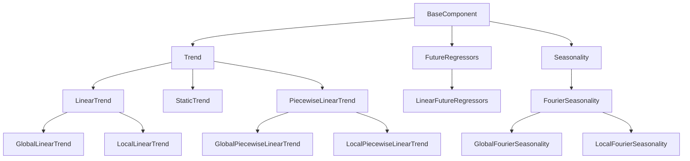

# Component overview
This chart provides an overview of all modular components and their inheritance structure.

```mermaid
flowchart TD
    BaseComponent --> Trend
    Trend --> LinearTrend
    LinearTrend --> GlobalLinearTrend
    LinearTrend --> LocalLinearTrend
    Trend --> StaticTrend
    Trend --> PiecewiseLinearTrend
    PiecewiseLinearTrend --> GlobalPiecewiseLinearTrend
    PiecewiseLinearTrend --> LocalPiecewiseLinearTrend
    BaseComponent --> FutureRegressors --> LinearFutureRegressors
    BaseComponent --> Seasonality
    Seasonality --> FourierSeasonality
    FourierSeasonality --> GlobalFourierSeasonality
    FourierSeasonality --> LocalFourierSeasonality
```